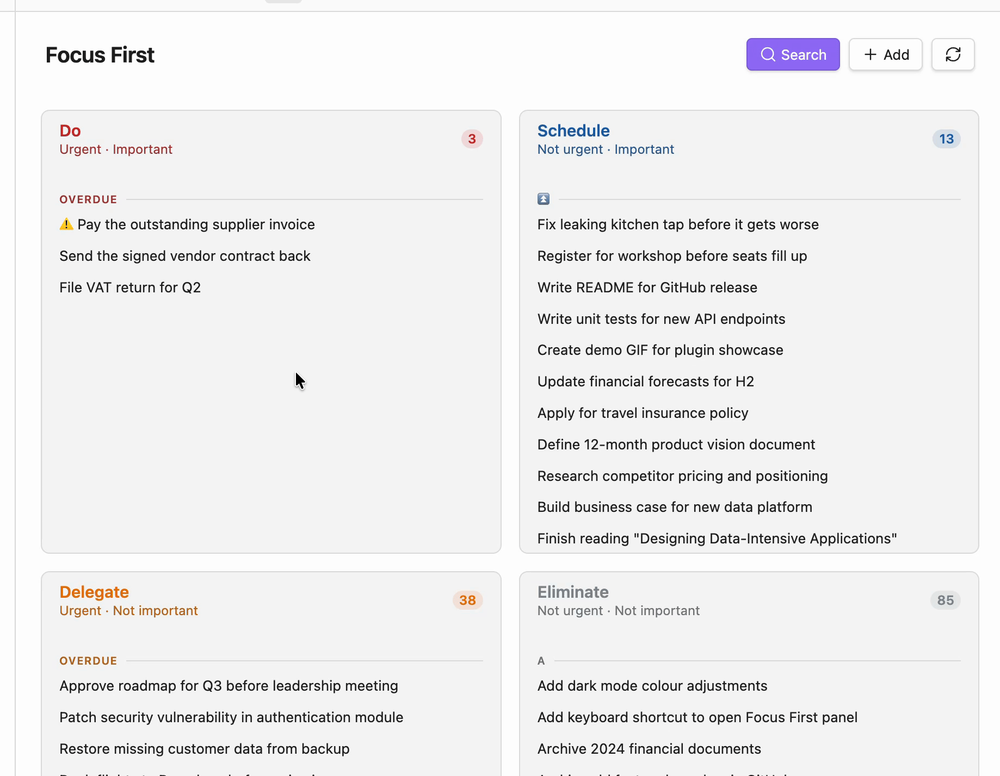

# Focus First

[](https://github.com/christian-luger-at/obsidian-focus-first/releases)
[](https://obsidian.md)
[](LICENSE)
[](https://github.com/christian-luger-at/obsidian-focus-first/actions/workflows/coverage.yml)
[](../../issues)

Stop guessing what to work on next. **Focus First** sorts your Obsidian tasks into the **Eisenhower matrix** — by urgency (due date) and importance (priority) — so the next right action is always obvious.



It reads standard checkbox tasks from your vault (compatible with the [Tasks plugin](https://obsidian.tasks.org/) format — due dates, priorities, tags) and places each one automatically:

| | Urgent | Not urgent |
| --- | --- | --- |
| **Important** | 🔴 **Do** — handle now | 🔵 **Schedule** — plan for later |
| **Not important** | 🟠 **Delegate** — hand off if possible | ⚪ **Eliminate** — reconsider or drop |

No manual sorting needed — though you can still pin any task to a quadrant by hand.

## Features

- **Automatic classification** — tasks are sorted into quadrants based on their due date (urgency) and priority (importance), no setup needed beyond your existing Tasks-plugin workflow.
- **Two matrices, one view** — switch the axes from the header between the classic **Eisenhower** (Urgency × Importance) and a **Value/Effort** matrix (Quick Wins / Big Bets / Fill-ins / Time Sinks). Value comes from your priority (default) or a `#highvalue`/`#lowvalue` tag; effort comes from task size (`#s`/`#m`/`#l`). Same auto-classification and "why here" explanation, just different axes — due date is deliberately never treated as value.
- **Manual quadrant tags** — add a tag like `#do` or `#eliminate` to any task to pin it to a quadrant, overriding the automatic logic.
- **Focus Tasks / today plan** — tag a task with `#focus` to pin it in a dedicated section above the matrix, so your top priorities never get buried. The section is an ordered, numbered shortlist (most important first, so #1 is your "frog"), which supports daily-planning methods like **Eat the Frog**, **Ivy Lee**, and **MITs**. **Drag focus tasks to reorder them by hand** — your manual order is remembered — or leave them in the automatic importance order. Set an optional daily target (e.g. 6 or 3) and a subtle line marks where the list runs past it.
- **Hide & snooze tasks** — tag a task with `#hide` (or use the hide button) to remove it from the matrix without completing it. Hide it indefinitely, or **hide until a date** (tomorrow, next week, next Monday) — the task disappears now and comes back on its own when the date arrives. Under the hood, "hide until" just adds a start date (`🛫`), so it's the same mechanism, not a separate one.
- **Clean list, details on demand** — the list shows just task titles (click a title to open its note). Hover a task to open a detail popover next to the cursor: it explains *why* the task landed in its quadrant (urgent/important reasoning or a manual tag), shows its metadata (priority, dates, tags, source), and offers one-click actions — complete, focus, hide, postpone the due date, or change priority — without opening the note. Every action (including drag & drop) shows a brief **Undo** toast.
- **Task size & quick wins** — mark how big a task is with an open, configurable tag (default `#s` / `#m` / `#l` for small / medium / large) — set or clear it from the task's popover, no minute estimates. A size filter in the search area narrows the matrix to the chosen size(s); checking just **Small** is the "quick wins" lens for when you have a small gap. The size is a plain tag, so Dataview or the Tasks plugin can read it too.
- **Future tasks** — tasks with a start (`🛫`) or scheduled (`⏳`) date still in the future aren't actionable yet; choose to show, dim, or hide them until their date arrives.
- **Quick add** — capture a task without leaving the view (the `+` button in the header, or the "Add task" command / hotkey). When the Tasks plugin is enabled, this opens its full create dialog (date, priority, and recurrence pickers); otherwise a simple input is used. The new task is appended to a configurable inbox note or the active note — and the very first time you add a task, Focus First asks which inbox note to use (created if missing) and remembers it.
- **Drag & drop** — drag a task between quadrants to instantly re-tag it, or drag focus tasks within the focus list to set (and persist) their manual order.
- **Search & filters** — the search bar is tucked behind a search icon in the header, so it only takes up space when you need it; open it to search across all visible tasks, filter by due-date bucket (overdue, today, this week, upcoming, no date), or filter by task size (small / medium / large).
- **Grouping & sorting** — group tasks within a quadrant by priority, due date, or alphabetically, with independently configurable primary/secondary sort order per quadrant.
- **Folder scope** — scan your entire vault or limit Focus First to a single folder (including sub-folders).
- **Adjustable font size** — scale the text size of the Focus First view independently of Obsidian's global font size.
- **Auto-refresh** — the view updates automatically whenever a task file changes.
- **Locale-aware dates** — due dates are formatted according to Obsidian's configured language.
- **English & German UI** — Focus First follows Obsidian's language setting.

## Getting started

1. Install the plugin (see below) and enable it under **Settings → Community plugins**.
2. Open the **Focus First** view via the ribbon icon or the command palette (`Open Focus First`).
3. Write tasks anywhere in your vault using standard Markdown checkboxes. Focus First understands the [Tasks plugin](https://obsidian.tasks.org/) syntax:

   ```markdown
   - [ ] Finish the quarterly report 📅 2026-07-02 🔺
   - [ ] Reply to client email #focus
   - [ ] Reorganize the archive folder ⏬
   ```

4. Open the Focus First view — your tasks will already be sorted into the four quadrants.

## How tasks are classified

A task is considered **urgent** if it has a due date that is today, overdue, or within the configured **urgency threshold** (default: 3 days — adjustable in settings, 0–364 days).

A task is considered **important** if it carries one of the priorities selected in **Important priorities** (default: 🔺 Highest and ⏫ High).

| Urgent | Important | Quadrant |
| --- | --- | --- |
| ✅ | ✅ | **Do** |
| ❌ | ✅ | **Schedule** |
| ✅ | ❌ | **Delegate** |
| ❌ | ❌ | **Eliminate** |

A task without a due date is never automatically urgent. A task without a priority (or with a priority not in your "important" list) is never automatically important — by default, only 🔺 and ⏫ count as important, while 🔼🔽⏬ do not.

### Overriding the automatic classification

Each quadrant has a configurable tag (defaults: `#do`, `#schedule`, `#delegate`, `#eliminate`). Adding that tag to a task always places it in the matching quadrant, regardless of its due date or priority. This is useful for tasks that don't fit the urgent/important model — for example, a low-priority task you've manually decided needs immediate attention.

## Embedding tasks in a note

A `focus-first-tasks` code block embeds a task list into any note. It has two modes, and parameters use a simple `key value` form (no colons).

### Show a Focus First section

Add a `show-focus` line to render exactly the tasks Focus First would show for one of its sections — the focus list or a single quadrant — as a checklist:

````markdown
```focus-first-tasks
show-focus do
empty-text 🎉 Nothing urgent and important
```
````

`show-focus` accepts `focus`, `do`, `schedule`, `delegate`, or `eliminate`. The tasks are selected with Focus First's own classification (so they match the view exactly, including your urgency threshold, important priorities, quadrant tags, and hide tag) and the list stays in sync as tasks change. When the section is empty, the optional `empty-text` message is shown.

The tasks are rendered through Obsidian's Markdown renderer, so they get the same formatting as normal tasks — including the Tasks plugin's rendering when it is enabled. The Tasks plugin is not required (without it, the tasks appear as a plain checklist), and checking a box completes the correct task in its source note.

### Wrap a Tasks-plugin query

Without a `show-focus` line, everything except the `empty-text` line is passed straight to the [Tasks plugin](https://obsidian.tasks.org/) as a query, so the full [Tasks query syntax](https://publish.obsidian.md/tasks/Queries/About+Queries) is available and the result is rendered by Tasks itself:

````markdown
```focus-first-tasks
not done
tags include #focus
sort by priority

empty-text 🎉 Nothing to focus on right now
```
````

When the query matches no tasks, the `empty-text` message is shown instead. (The dedicated `show-focus` key never clashes with Tasks-plugin instructions such as `show tree`, so those keep working inside the query.)

> [!note]
> The query mode requires the **Tasks plugin** to be installed and enabled — it renders the Tasks plugin's own output. Without it, the block shows a short notice. (The `show-focus` mode works without the Tasks plugin.)

### Parameters

| Parameter | Mode | Description |
| --- | --- | --- |
| `show-focus <section>` | Section | Render a Focus First section: `focus`, `do`, `schedule`, `delegate`, or `eliminate`. |
| `empty-text <message>` | Both | Message shown when nothing matches (optional). |
| *(any other line)* | Query | Passed to the Tasks plugin as part of the query. |

## Settings overview

| Section | What it controls |
| --- | --- |
| **Task Sources** | Scan the entire vault, or limit to one folder (with sub-folders); optionally exclude indented subtasks |
| **Classification** | Urgency threshold (days), which priorities count as "important", and how to treat not-yet-started tasks whose start (`🛫`) or scheduled (`⏳`) date is still in the future (show, dim, or hide) |
| **Quadrants** | Per-quadrant accent color, manual override tag, sort order, and grouping |
| **Tags** | The special tags: Focus (default `#focus`), Hide (default `#hide`), and the optional size tags (default `#s`/`#m`/`#l`) |
| **Value / Effort matrix** | For the Value/Effort preset: the value source (priority or manual tag), the `#highvalue`/`#lowvalue` override tags, and which sizes count as low effort |
| **Quick Add** | Where quick-added tasks go: a configurable inbox note (created if missing) or the active note. On first use, if no inbox note is set, a dialog asks for one. |
| **Appearance** | Font size used throughout the Focus First view; toggle the "why here" reason in the detail popover |
| **Reset** | Restore every setting to its default value |

## Installing the plugin

### From the Community Plugins browser (once published)

1. Open **Settings → Community plugins** in Obsidian.
2. Disable **Safe mode** if needed, then click **Browse**.
3. Search for "Focus First" and click **Install**, then **Enable**.

### Manual installation

1. Download `main.js`, `styles.css`, and `manifest.json` from the [latest release](../../releases).
2. Copy them into `<YourVault>/.obsidian/plugins/focus-first/`.
3. Reload Obsidian and enable **Focus First** under **Settings → Community plugins**.

## Compatibility

- Requires Obsidian **1.12.0** or later.
- Works on desktop and mobile.
- Works alongside the [Tasks plugin](https://obsidian.tasks.org/) — Focus First reads the same checkbox/due-date/priority syntax but doesn't require it (only the code block's query mode needs the Tasks plugin).

## Support

Found a bug or have a feature request? Please [open an issue](../../issues).

If Focus First helps you, a ⭐ on the repo makes it easier for others to discover — thank you!

## Contributing

Contributions are welcome. See [CONTRIBUTING.md](CONTRIBUTING.md) for how to report issues, set up the project, and open a pull request.

## License

Focus First is licensed under the [MIT License](LICENSE). © 2026 Christian Luger.
