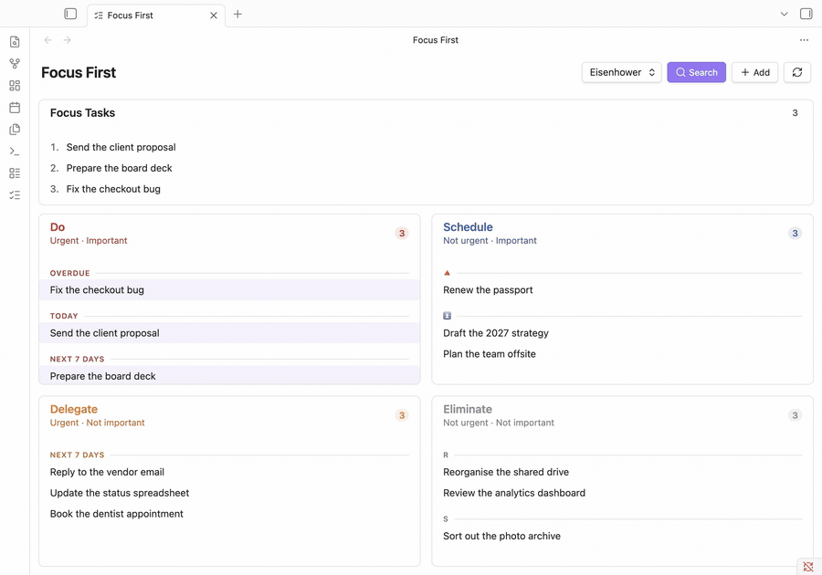

# Focus First

Stop guessing what to work on next. **Focus First** sorts your Obsidian tasks into the **Eisenhower matrix**, by urgency (due date) and importance (priority), so the next right action is always obvious.

It reads standard checkbox tasks from your vault (compatible with the [Tasks plugin](https://obsidian.tasks.org/) format - due dates, priorities, tags) and places each one automatically:

| | Urgent | Not urgent |
| --- | --- | --- |
| **Important** | **Do** - handle now | **Schedule** - plan for later |
| **Not important** | **Delegate** - hand off if possible | **Eliminate** - reconsider or drop |

No manual sorting needed - though you can still pin any task to a quadrant by hand.

> 📖 **Full guides, concepts, and reference: [Focus First documentation](https://christian-luger-at.github.io/obsidian-focus-first/)**

## Features

- **Automatic Eisenhower classification** - tasks sorted by urgency (due date) and importance (priority), with no setup.
- **Two matrices in one view** - switch between Eisenhower and Value/Effort, or drag a task between quadrants to re-classify it.
- **Focus / today plan** - an ordered, numbered `#focus` shortlist for daily-planning methods like Eat the Frog, Ivy Lee, and MITs.
- **Task size & quick wins** - tag sizes (`#s`/`#m`/`#l`) and filter the matrix to short tasks.
- **Details on demand** - hover (desktop) or tap (mobile) a task for its "why here" reason, metadata, and one-click actions, each with a brief Undo.
- **Capture & embed** - quick-add, hide/snooze, search & filters, and embeddable task lists. Works on desktop and mobile, in English and German.

→ See the [full feature overview](https://christian-luger-at.github.io/obsidian-focus-first/guide/introduction#feature-overview) and guides in the documentation.

## Documentation

The complete guides live at **[christian-luger-at.github.io/obsidian-focus-first](https://christian-luger-at.github.io/obsidian-focus-first/)**:

- [Prioritization methods](https://christian-luger-at.github.io/obsidian-focus-first/methods/) - the *why* behind Eisenhower, Value/Effort, Eat the Frog, Ivy Lee, and MITs
- [Getting started](https://christian-luger-at.github.io/obsidian-focus-first/guide/getting-started)
- [How tasks are classified](https://christian-luger-at.github.io/obsidian-focus-first/guide/classification)
- [The two matrices](https://christian-luger-at.github.io/obsidian-focus-first/guide/matrices)
- [Focus, size & filters](https://christian-luger-at.github.io/obsidian-focus-first/guide/focus-size-filters)
- [Embedding tasks in a note](https://christian-luger-at.github.io/obsidian-focus-first/guide/embedding)
- [Settings](https://christian-luger-at.github.io/obsidian-focus-first/guide/settings)

## Installing the plugin

### From the Community Plugins browser (once published)

1. Open **Settings → Community plugins** in Obsidian.
2. Disable **Safe mode** if needed, then click **Browse**.
3. Search for "Focus First" and click **Install**, then **Enable**.

### Manual installation

1. Download `main.js`, `styles.css`, and `manifest.json` from the [latest release](../../releases).
2. Copy them into `<YourVault>/.obsidian/plugins/focus-first/`.
3. Reload Obsidian and enable **Focus First** under **Settings → Community plugins**.

## Compatibility

- Requires Obsidian **1.12.0** or later.
- Works on desktop and mobile.
- Works alongside the [Tasks plugin](https://obsidian.tasks.org/) - Focus First reads the same checkbox/due-date/priority syntax but doesn't require it (only the code block's query mode needs the Tasks plugin).

## Support

Found a bug or have a feature request? Please [open an issue](../../issues).

If Focus First helps you, a ⭐ on the repo makes it easier for others to discover - thank you!

## Contributing

Contributions are welcome. See [CONTRIBUTING.md](CONTRIBUTING.md) for how to report issues, set up the project, and open a pull request, and [DEVELOPMENT.md](DEVELOPMENT.md) for the local dev/test workflow, the release process, and a **demo-vault generator** (`node scripts/gen-demo-vault.mjs`) that spins up a 400-note product-management vault with 100 varied tasks to try the plugin against.

## License

Focus First is licensed under the [MIT License](LICENSE). © 2026 Christian Luger.
