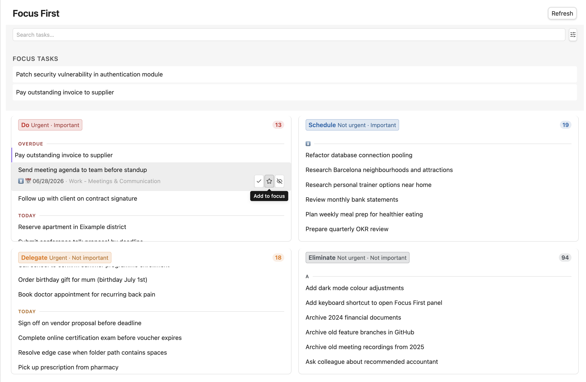

# Focus First

[](https://github.com/christian-luger-at/obsidian-focus-first/releases)
[](https://obsidian.md)
[](LICENSE)
[](../../issues)

Stop guessing what to work on next. **Focus First** sorts your Obsidian tasks into the **Eisenhower matrix** — automatically, based on due date and priority — so the next right action is always obvious.



Focus First reads checkbox tasks from your vault (compatible with the [Tasks plugin](https://obsidian.tasks.org/) format: due dates, priorities, tags) and displays them automatically sorted into:

| | Urgent | Not urgent |
| --- | --- | --- |
| **Important** | 🔴 **Do** — handle now | 🔵 **Schedule** — plan for later |
| **Not important** | 🟠 **Delegate** — hand off if possible | ⚪ **Eliminate** — reconsider or drop |

No manual sorting required — classification happens automatically based on each task's due date and priority, with the option to manually pin any task to a quadrant.

## Features

- **Automatic classification** — tasks are sorted into quadrants based on their due date (urgency) and priority (importance), no setup needed beyond your existing Tasks-plugin workflow.
- **Manual quadrant tags** — add a tag like `#do` or `#eliminate` to any task to pin it to a quadrant, overriding the automatic logic.
- **Focus Tasks** — tag a task with `#focus` to pin it in a dedicated section above the matrix, so your top priorities never get buried.
- **Hide tasks** — tag a task with `#hide` (or use the hide button) to remove it from the matrix without completing it — useful for tasks you're not ready to act on yet.
- **Drag & drop** — drag a task between quadrants to instantly re-tag it.
- **Search & filters** — search across all visible tasks, or filter by due-date bucket (overdue, today, this week, upcoming, no date).
- **Grouping & sorting** — group tasks within a quadrant by priority, due date, or alphabetically, with independently configurable primary/secondary sort order per quadrant.
- **Folder scope** — scan your entire vault or limit Focus First to a single folder (including sub-folders).
- **Adjustable font size** — scale the text size of the Focus First view independently of Obsidian's global font size.
- **Auto-refresh** — the view updates automatically whenever a task file changes.
- **Locale-aware dates** — due dates are formatted according to Obsidian's configured language.
- **English & German UI** — Focus First follows Obsidian's language setting.

## Getting started

1. Install the plugin (see below) and enable it under **Settings → Community plugins**.
2. Open the **Focus First** view via the ribbon icon (checkmark) or the command palette (`Open Focus First`).
3. Write tasks anywhere in your vault using standard Markdown checkboxes. Focus First understands the [Tasks plugin](https://obsidian.tasks.org/) syntax:

   ```markdown
   - [ ] Finish the quarterly report 📅 2026-07-02 🔺
   - [ ] Reply to client email #focus
   - [ ] Reorganize the archive folder ⏬
   ```

4. Open the Focus First view — your tasks will already be sorted into the four quadrants.

## How tasks are classified

A task is considered **urgent** if it has a due date that is today, overdue, or within the configured **urgency threshold** (default: 3 days — adjustable in settings, 0–364 days).

A task is considered **important** if it carries one of the priorities selected in **Important priorities** (default: 🔺 Highest and ⏫ High).

| Urgent | Important | Quadrant |
| --- | --- | --- |
| ✅ | ✅ | **Do** |
| ❌ | ✅ | **Schedule** |
| ✅ | ❌ | **Delegate** |
| ❌ | ❌ | **Eliminate** |

A task without a due date is never automatically urgent. A task without a priority (or with a priority not in your "important" list) is never automatically important — by default, only 🔺 and ⏫ count as important, while 🔼🔽⏬ do not.

### Overriding the automatic classification

Each quadrant has a configurable tag (defaults: `#do`, `#schedule`, `#delegate`, `#eliminate`). Adding that tag to a task always places it in the matching quadrant, regardless of its due date or priority. This is useful for tasks that don't fit the urgent/important model — for example, a low-priority task you've manually decided needs immediate attention.

## Tasks query with a fallback message

If you use the [Tasks plugin](https://obsidian.tasks.org/), you can embed one of its queries in any note through a `focus-first-tasks` code block and add a **fallback message** shown when the query returns nothing:

````markdown
```focus-first-tasks
not done
tags include #focus
sort by priority

fallback: 🎉 Nothing to focus on right now
```
````

Everything except the `fallback:` line is passed straight to the Tasks plugin, so the full [Tasks query syntax](https://publish.obsidian.md/tasks/Queries/About+Queries) is available and the result is rendered by Tasks itself. When the query matches no tasks, the `fallback:` text is shown instead.

> [!note]
> This block requires the **Tasks plugin** to be installed and enabled — it renders the Tasks plugin's own output. Without it, the block shows a short notice instead.

## Settings overview

| Section | What it controls |
| --- | --- |
| **Appearance** | Font size used throughout the Focus First view |
| **Task Sources** | Scan the entire vault, or limit to one folder (with sub-folders) |
| **Focus Task** | The tag used to pin tasks to the Focus Tasks section (default `#focus`) |
| **Hide Task** | The tag used to hide tasks from the matrix (default `#hide`) |
| **Eisenhower Matrix** | Urgency threshold (days) and which priorities count as "important" |
| **Quadrants** | Per-quadrant accent color, manual override tag, sort order, and grouping |
| **Reset** | Restore every setting to its default value |

## Installing the plugin

### From the Community Plugins browser (once published)

1. Open **Settings → Community plugins** in Obsidian.
2. Disable **Safe mode** if needed, then click **Browse**.
3. Search for "Focus First" and click **Install**, then **Enable**.

### Manual installation

1. Download `main.js`, `styles.css`, and `manifest.json` from the [latest release](../../releases).
2. Copy them into `<YourVault>/.obsidian/plugins/focus-first-matrix/`.
3. Reload Obsidian and enable **Focus First** under **Settings → Community plugins**.

## Compatibility

- Requires Obsidian **1.12.0** or later.
- Desktop only.
- Works alongside the [Tasks plugin](https://obsidian.tasks.org/) — Focus First reads the same checkbox/due-date/priority syntax but does not require the Tasks plugin to be installed.

## Support

Found a bug or have a feature request? Please [open an issue](../../issues).

If you find Focus First useful, you can support its development at <https://www.christian-luger.at/pricing>.

## License

See [LICENSE](LICENSE) for details.
